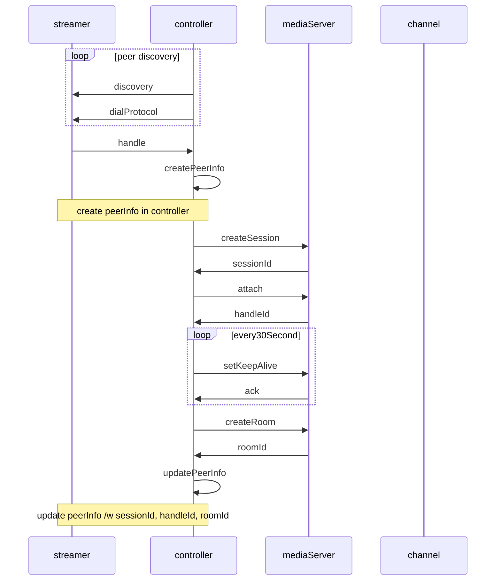
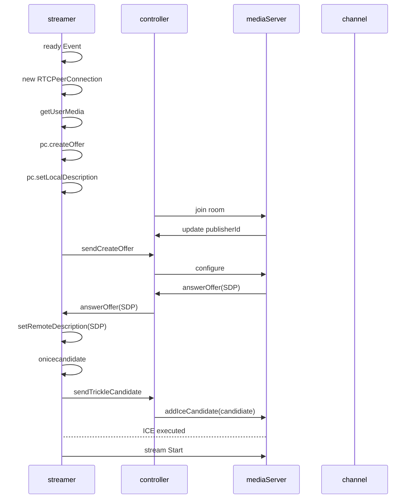
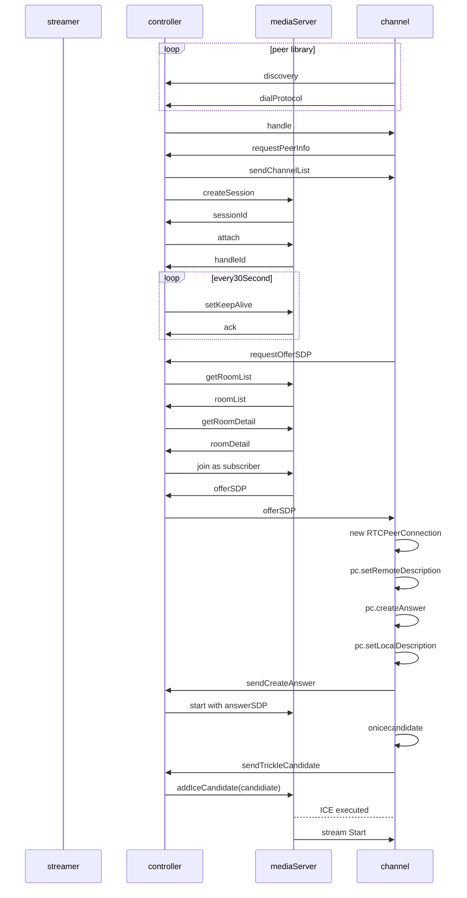

# Prerequisites
* node.js(10.x+)
* docker (if you want to run Windows on your PC)

# How to start
## build all
(from root directory)
```
cd streamer
npm install
cd ../controller
npm install
cd ../channels
npm install
cd ../mediaServer
npm run build
```
## start servers
### mediaServer (docker only)
```
cd mediaServer
npm start
```
### controller
```
cd controller
npm start
```
### streamer(webServer)
```
cd streamer
npm start
```
### channels(webServer)
```
cd channels
npm start
```
# Workflow sequence diagrams
## Initialize

## Streamer Connect

## Channel Connection


