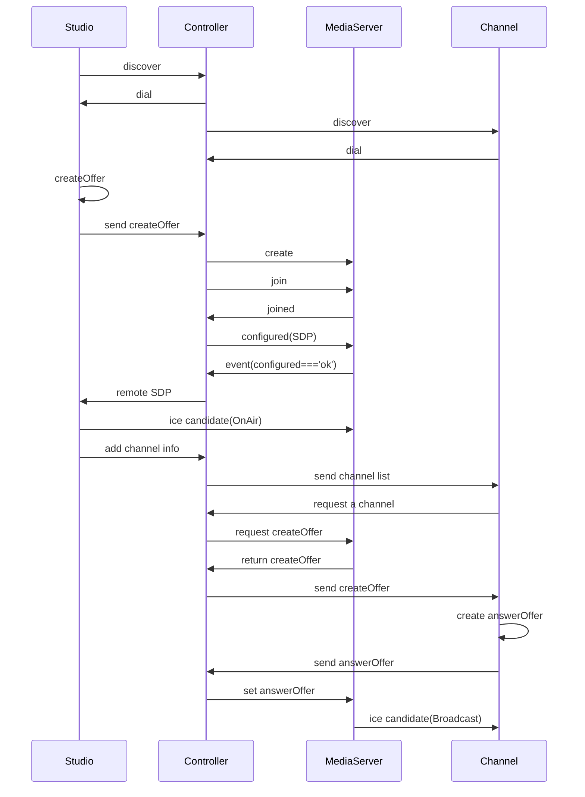

```mermaid
sequenceDiagram
participant Studio
participant Controller
participant MediaServer
participant Channel
Studio->>Controller: discover
Controller->>Studio: dial
Controller->>Channel: discover
Channel->>Controller: dial
Studio->>Studio: createOffer
Studio->>Controller: send createOffer
Controller->>MediaServer: create
Controller->>MediaServer: join
MediaServer->>Controller: joined
Controller->>MediaServer: configured(SDP)
MediaServer->>Controller: event(configured==='ok')
Controller->>Studio: remote SDP
Studio->>MediaServer: ice candidate(OnAir)
Studio->>Controller: add channel info
Controller->>Channel:send channel list
Channel->>Controller: request a channel
Controller->>MediaServer: request createOffer
MediaServer->>Controller: return createOffer
Controller->>Channel:send createOffer
Channel->>Channel:create answerOffer
Channel->>Controller: send answerOffer
Controller->>MediaServer: set answerOffer
MediaServer->>Channel: ice candidate(Broadcast)

```

